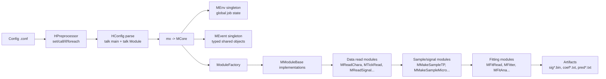
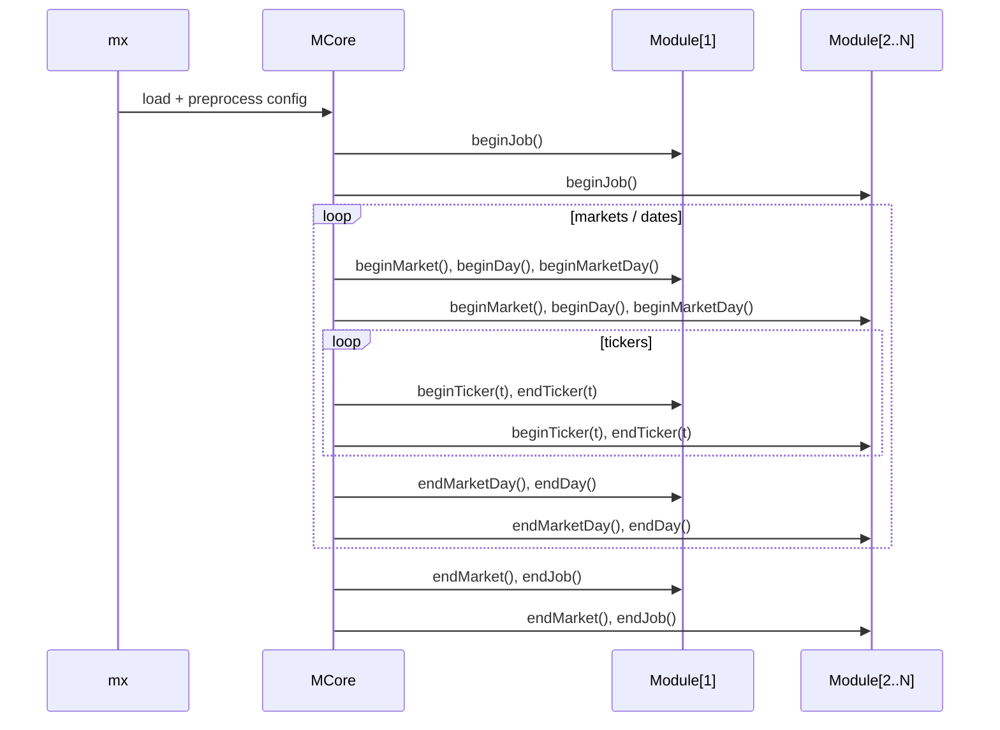

# Equities Prediction Model (Legacy)

Intraday equities/futures signal generation, fitting, prediction, and analysis framework built primarily in C++.

Development froze in 2022.

## Repository At A Glance

| Metric | Value |
|---|---|
| Total files | ~1206 |
| Main implementation languages | C++ (`.cpp`/`.h`), shell, Python, config DSL (`.conf`) |
| Build system | CMake (top-level), plus legacy Visual Studio solutions |
| Primary runtime binaries | `mx`, `hf`, `sigDump`, `tickDataDump`, `tickDataCount`, `checkParams`, `compPred`, `compSig` |
| Core paradigm | Config-driven module pipeline (`talk main -> module ...`) |

## What This Codebase Does

This codebase is a production-style modeling framework that:

1. Reads market/order/reference data.
2. Builds intraday samples/signals (`om`, `tm`, `ome`, etc.).
3. Fits models (notably boosted decision trees, plus other historical model families).
4. Writes predictions and model artifacts.
5. Runs pseudo-trading and post-fit analytics.

Most jobs run through `mx` with `.conf` files under `scripts/model`, `scripts/gtConf`, `scripts/param`, and `scripts/ntrees`.

## High-Level Architecture



## Module Lifecycle

`MCore` executes modules in configured order and loops over market/date/ticker dimensions.



## Top-Level Layout

| Path | Purpose |
|---|---|
| `source/include` | Public headers for framework/modules/libs |
| `source/src` | Core libraries and module implementations |
| `source/bin` | CLI executables (`mx`, `hf`, diagnostics, data tools) |
| `scripts/model` | Main production-like pipeline driver (`pmodel.sh`) + conf packs |
| `scripts/gtConf` | Older conf pack variants for `mx` jobs |
| `scripts/param` | Parameter calculation/write workflows |
| `scripts/ntrees` | Tree-count experiments and evaluation workflows |
| `scripts/oosMon`, `scripts/oosMon2` | OOS monitoring HTML/report tooling |
| `cronjobs` | Monitoring, order summary, and maintenance cron tooling |
| `guis` | ROOT-based visualization tools (`mon`, `bidask`, `bboComp`, etc.) |
| `vsprojs` | Legacy Visual Studio solutions/projects |
| `dbacc` | Legacy DB project files (`.dbp`) |
| `cmake/FindROOT.cmake` | ROOT package detection and ROOT dictionary helpers |

## Core Library Groups (`source/src`)

| Group | Typical Role |
|---|---|
| `MFramework`, `MCore` | Runtime orchestration (`MEnv`, `MEvent`, module lifecycle) |
| `MSignal`, `MSigMod` | Feature/signal/sample generation from tick/chara/order/news data |
| `MFitMod`, `MFitting`, `MFitObj` | Fit-data loading, model fitting, pseudo-trading, fit analysis |
| `MOrders` | Order/trade analytics modules |
| `gtlib_*` | Signal IO, fitting primitives, pred analytics, model/path helpers |
| `jl_lib` | Utility/core infrastructure (args, DB, calendars, preprocessing, etc.) |
| `H*` (`HCore`, `HOrders`, `HTickSeries`, etc.) | Separate legacy analysis pipeline invoked via `hf` |

## Main Pipeline Stages

| Stage | Typical command | Representative conf | Main modules |
|---|---|---|---|
| Index prep | `pmodel.sh <MKT> index ...` | `scripts/model/index_*.conf` | `MInitModel`, `MTickReadIndex`, `MFitIndexAR` |
| Sample generation | `pmodel.sh <MKT> sample ...` | `scripts/model/sample_*_*.conf` | `MInitModel`, `MReadChara`, `MMakeSampleTP` |
| Fit | `pmodel.sh <MKT> fit ...` | `scripts/model/fit_*.conf` | `MInitModel`, `MFitRead`, `MFitter` |
| Predict | `pmodel.sh <MKT> pred ...` | `scripts/model/pred_*.conf` | `MInitModel`, `MFitRead`, `MFitter` (prediction mode) |
| Analyze | `pmodel.sh <MKT> ana ...` | `scripts/model/ana*.conf` | `MInitModel`, `MFitAna` |
| Write model outputs | `pmodel.sh <MKT> write ...` | `scripts/model/write_*.conf` | `MInitModel`, `MWriteTree` |

## Config DSL

Configs are not plain key-value files; they support preprocessing.

| Construct | Meaning |
|---|---|
| `talk main ... exit` | Declares ordered module list |
| `talk <Module> ... exit` | Declares options for one module instance |
| `set name value...` | Define variables |
| `call file.conf` | Include another config |
| `if <expr> { ... } else { ... }` | Conditional inclusion (`begins` operator supported) |
| `foreach var list... { ... }` | Loop expansion |
| `-a "set x y"` (CLI) | Runtime assignment overrides passed to `mx` |

Minimal pattern:

```conf
call base.conf

talk main
  module MInitModel
  module MFitRead
  module MFitter
exit

talk MInitModel
  model $model
  udate $udate
  sigType om
exit
```

## Key Executables

| Binary | Purpose |
|---|---|
| `mx` | Main module-runner for model/signal/fitting jobs |
| `hf` | Runs legacy `HCore`-based analysis pipelines |
| `sigDump` | Inspect binary signal files (`sig*.bin`) by ticker/fields/time |
| `tickDataDump` | Dump quote/trade/nbbo/order data and summaries |
| `tickDataCount` | Count tick activity by time buckets |
| `db` | Small SQL helper for ad hoc DB queries |
| `get_idate` | Trading/calendar date utility for scripts |
| `checkParams` | Sanity checks for model parameters/universe readiness |
| `compPred` / `compSig` | Compare predictions/signals across environments |
| `merge_us_book` | Merge US book sources over date ranges |

## Artifact Layout

Paths are assembled in `gtlib_model/pathFtns.cpp`.

| Artifact | Pattern |
|---|---|
| Signal bin | `<baseDir>/<model>/binSig<Desc>/<sigType>/sigYYYYMMDD.bin` |
| Signal txt | `<baseDir>/<model>/txtSig<Desc>/<sigType>/sigTBYYYYMMDD.txt` |
| Fit root | `<baseDir>/<model>/fit<Desc>/<targetName>/` |
| Coefficients | `<fit-root>/coef/coefYYYYMMDD.txt` |
| Predictions | `<fit-root>/stat_<udate>/preds/predYYYYMMDD.txt` |
| Covariance dirs | `<baseDir>/<model>/cov`, `<baseDir>/<model>/tmCov` |

`<Desc>` is empty for regular (`reg`) jobs and capitalized for others (for example `Tevt`).

## Build Notes

This repository depends on internal/legacy infrastructure. It is not fully standalone.

### Required dependencies visible from source/build files

| Dependency | Evidence |
|---|---|
| C++11 toolchain | top-level `CMAKE_CXX_FLAGS` uses `-std=c++11` |
| Boost (`thread`, `filesystem`) | top-level `find_package(Boost COMPONENTS thread filesystem)` |
| ROOT | `find_package(ROOT COMPONENTS Gui)` + ROOT dictionary generation |
| Additional internal libs | `tickdata`, `optionclasses` linked by `source/bin/CMakeLists.txt` |
| DB/market infra | heavy use of `GODBC`, exchange/calendar/tick source wrappers |

### Build commands (best effort)

```bash
cmake -S . -B build -DCMAKE_BUILD_TYPE=Release
cmake --build build -j
cmake --install build
```

Important behavior:

1. Install prefix defaults to `/home/jelee/gtbin` (or `/home/mercator1/paramjobs/gtbin` on specific hostnames).
2. Runtime scripts assume binaries are on `PATH` (`scripts/gtSetup.sh` exports `$HOME/gtbin/bin`).
3. `mx` defaults its config directory to `/home/jelee/scripts/gtConf` unless `-d` is provided.

## Running Jobs

### Direct `mx` usage

```bash
mx fit_om.conf -d scripts/model \
  -a "set model US" \
  -a "set udate 20240131"
```

### Scripted pipeline (`pmodel.sh`)

```bash
cd scripts/model
./pmodel.sh US sample om 20240101 20240131
./pmodel.sh US fit om 20240131
./pmodel.sh US pred om 20240131 20240201 20240215
./pmodel.sh US ana om 20240131 20240201 20240215
```

## Operational Caveats

| Area | Caveat |
|---|---|
| Environment assumptions | Many scripts use hardcoded paths (`/home/jelee`, `$HOME/hffit2`, legacy network mounts). |
| Infrastructure coupling | DB schemas, ODBC names, tick storage layout, and exchange metadata are assumed to exist. |
| Host-specific behavior | Some scripts branch on `HOSTNAME`; install/deploy scripts can be environment-specific. |
| Legacy status | No active maintenance since 2022; expect drift vs. modern toolchains/deps. |
| Testing | No modern unit/integration test harness in repo; validation is job/data driven. |

## Where To Start If You Are New

1. Read `scripts/model/pmodel.sh` and `scripts/model/*.conf` to understand production workflow.
2. Trace `mx -> MCore -> ModuleFactory -> selected modules`.
3. Use `sigDump`/`tickDataDump` on small date ranges to verify data availability.
4. Add `-p` (print mode) and limited ticker/date windows before running larger jobs.
